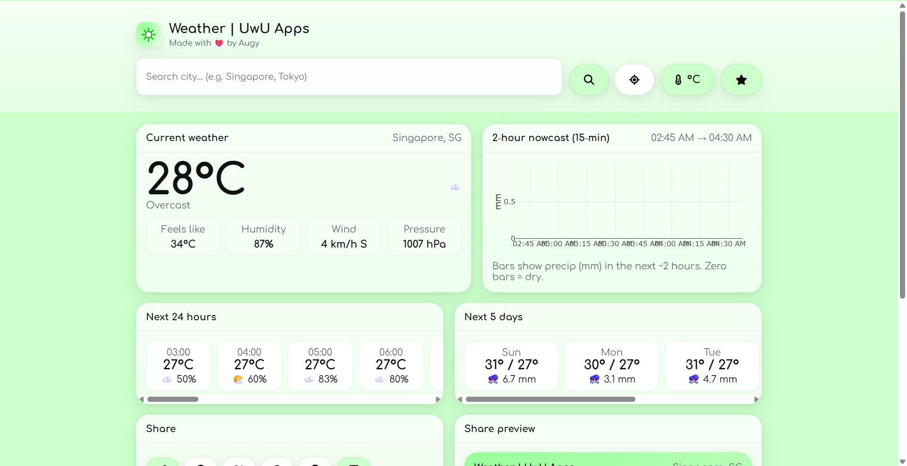

# UwU Weather

An open-source, install-anywhere weather PWA. Search any city (or use your location) and get current conditions, an hourly strip, a 7-day outlook, and a 15-minute precipitation nowcast — with a share card you can post straight to social.

Live at **[weatherapp.today](https://weatherapp.today)** · Android build on **[Google Play](https://play.google.com/store/apps/details?id=com.augystudios.weatherapp)**



## Features

- **Current conditions** — temperature, feels-like, humidity, wind (speed + direction), and surface pressure
- **Forecasts** — next 24 hours as scrollable pills, plus a 7-day daily outlook
- **Precipitation nowcast** — 15-minute-resolution Plotly chart of what's coming
- **Smart search** — free-text queries like `Springfield, IL, US` are parsed into name / region / country
- **Geolocation** — one tap for weather where you are
- **Saved locations** — pin up to 12 places as quick chips, stored locally
- **Unit toggle** — metric (°C, km/h) ⇄ imperial (°F, mph)
- **7 themes** — glassmorphism UI with a swatch picker; applied before first paint so there's no flash
- **Share card** — render the current conditions to an image, or share to Telegram / X / WhatsApp / Facebook
- **Installable PWA** — offline-capable service worker, app shortcuts for London, Paris, and Tokyo

## How it works

A static front end (vanilla HTML/CSS/JS — no build step, no framework) talking to two thin serverless
functions that proxy [Open-Meteo](https://open-meteo.com/).

```
main-site/
├── index.html, style.css, script.js   # the whole app
├── sw.js                              # service worker (cache-first shell)
├── manifest.json                      # PWA manifest, icons, shortcuts
├── api/
│   ├── forecast.js                    # → api.open-meteo.com/v1/forecast
│   ├── geocode.js                     # → geocoding-api.open-meteo.com/v1/search
│   └── auth/guest-key.js              # issues short-lived guest signing keys
└── lib/
    ├── uwu-request-signing.js         # client: HMAC-signed fetch (Web Crypto)
    └── uwu-request-signing-server.js  # server: verification + Supabase/PostgREST
```

### Request signing

The API routes aren't open proxies. Every call is HMAC-SHA256 signed over
`timestamp:method:path:bodyHash`:

1. The client asks `/api/auth/guest-key` for a session token + signing key (10-minute TTL,
   origin-checked, stored in `sessionStorage`).
2. `signedFetch()` signs each request and sends `X-Request-Token`, `X-Request-TS`, and `X-Key-ID`.
3. The server rejects stale timestamps (>30s skew), unknown or expired keys, bad signatures, and
   replayed tokens — the last via a used-token table, so each signature works exactly once.

Signing keys and spent tokens live in Supabase (`uwu_signing_keys`, `uwu_used_request_tokens`),
reached through a tiny hand-rolled PostgREST wrapper so there's no `supabase-js` dependency.

## Running locally

Requires Node 22 and the [Vercel CLI](https://vercel.com/docs/cli) (the `/api` routes are Vercel
serverless functions).

```bash
git clone https://github.com/augystudios/weather-app.git
cd weather-app/main-site
vercel dev
```

Set these environment variables (`.env.local` or the Vercel dashboard):

| Variable | Purpose |
| --- | --- |
| `SUPABASE_URL` | Supabase project URL |
| `SUPABASE_SERVICE_KEY` | Service-role key, used server-side only |
| `ALLOWED_ORIGINS` | Comma-separated origins allowed to request guest keys |

You'll also need the two tables described above. Want to skip the backend? The static front end
works on its own if you point `script.js` at Open-Meteo directly — the signing layer exists to keep
the hosted deployment from being used as a free proxy.

## Contributing

Issues and PRs are welcome. A few things worth knowing:

- There is no build step and no bundler. Keep it that way — plain ES modules and plain CSS.
- Themes are a single entry in the `THEMES` map in `script.js` plus a swatch button in `index.html`.
- Bump the `CACHE` constant in `sw.js` when you change cached assets, or clients will serve stale files.
- Please read the [Code of Conduct](CODE_OF_CONDUCT.md) before participating.
- Found a bug but don't want to file an issue? [Use the report form](https://forms.gle/4wKTdjgiC6MGX1aN8).

## Credits

- Weather and geocoding data by [Open-Meteo](https://open-meteo.com/) (CC BY 4.0)
- Charts by [Plotly](https://plotly.com/javascript/), icons by [Font Awesome](https://fontawesome.com/)
- [Paxriel](https://paxriel.art/) for general coding help

## License

[MIT](LICENSE) © Augy Studios

---

[Terms](https://augystudios.com/terms) • [EULA](https://augystudios.com/eula) • [Cookies](https://augystudios.com/cookies) • [Privacy](https://augystudios.com/privacy)

Made with 💚 in [Singapore](https://www.google.com/maps/place/Singapore)
